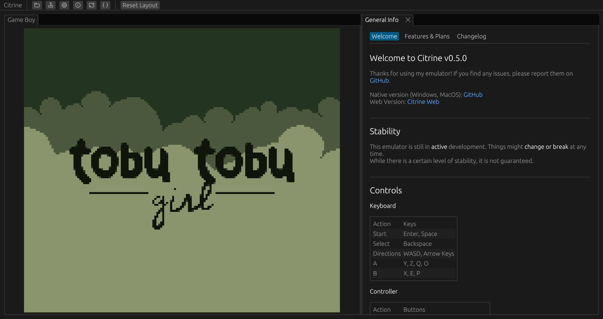

Some time ago I have started working on a Game Boy emulator in rust. My goal was to have nice debugging features and good performance while providing a good UX.

**You can try it out in the browser:** https://gb.lemon.industries\
**Its not made for mobile!**

### Features
- Full Game Boy video and audio
- Support for Windows, MacOS and Web
- Controller support
- Plays Game Boy games with MBC1, MBC2 and MBC3 cartridges (no RTC support yet)
- (M-)Cycle-accurate instruction and memory timing
- Save states for games that included a battery
- Includes bundled open source homebrew games
- Basic debugging tools
